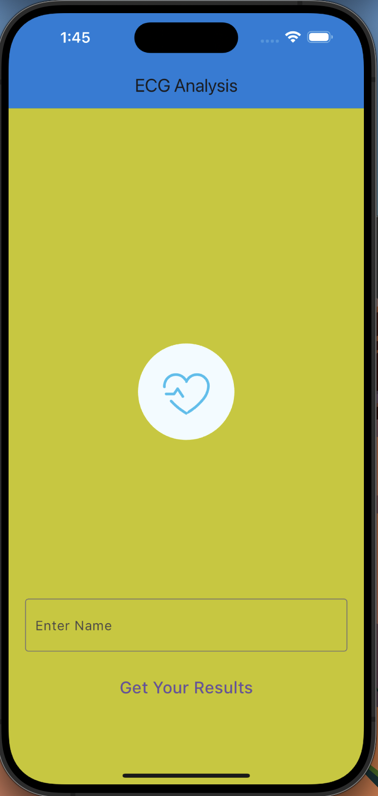

# Chronic Alcoholism Prediction App

This Flutter app predicts the risk of chronic alcoholism based on user input data using a machine learning model. It allows users to input their data, fetch the prediction from an API, and view the results.

## Features

- **Input Data**: Users can enter their name, which will be used as input for the prediction.
- **API Integration**: Utilizes an API endpoint to send user input data and receive the prediction.
- **Results Display**: Displays the prediction results, including the status and parameters related to chronic alcoholism.
- **PDF Report Generation**: Allows users to generate a PDF report of the prediction results for reference or sharing.

## How to Use

1. **Clone Repository**: Clone this repository to your local machine.

2. **Set up Backend**: Set up the backend server that hosts the machine learning model for predicting chronic alcoholism. Ensure that the API endpoint is accessible from the app.

3. **Install Dependencies**: Make sure you have Flutter installed on your machine. Run `flutter pub get` to install the required dependencies.

4. **Run the App**: Launch the app using the Flutter command `flutter run`. The app should start running on your connected device or emulator.

5. **Enter Name**: Enter your name in the provided text field. This will be used as input for the prediction.

6. **Get Prediction**: Click on the "Get Your Results" button to fetch the prediction from the API based on the entered name.

7. **View Results**: Once the prediction is received, the app will display the status and parameters related to chronic alcoholism.

8. **Generate PDF Report**: Optionally, you can generate a PDF report of the prediction results by clicking the "Generate PDF" button on the results screen.

## Dependencies

This app relies on the following dependencies:

- `http`: A package for making HTTP requests to fetch data from the API.
- `lottie`: A package for displaying Lottie animations in Flutter.
- `pdf`: A package for creating PDF documents in Flutter.
- `path_provider`: A Flutter plugin for accessing the device's file system.
- `open_file`: A Flutter plugin for opening files on the device.

## API Endpoint

Ensure that the API endpoint for predicting chronic alcoholism is correctly configured in the code (`Home.dart`). Update the URL variable (`url`) to match the address of your backend server.

